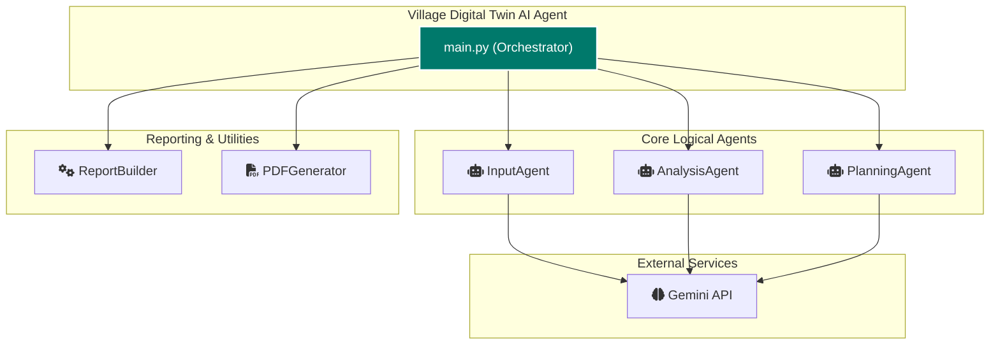

# Village Digital Twin AI Agent

## Project Overview - Village Digital Twin AI Agent

This project presents a command-line based AI agent designed to create a "digital twin" of an Indian village. Leveraging the power of the Gemini 2.5 Flash Lite model, the agent interactively gathers essential information from the user through a natural, Hinglish conversational interface. It then processes this data to perform comprehensive analyses and generate a strategic growth and development plan for the village.

The agent adheres to a modular, multi-agent architectural pattern, ensuring that various stages of the process—from data collection and detailed analysis to plan generation and multi-format reporting—are handled systematically and efficiently. This makes it suitable for use by government officers, NGO workers, students, and anyone involved in rural development.

## Problem Statement

Traditional village development planning often suffers from a lack of structured, holistic data. Manual data collection is laborious, prone to inconsistencies, and often fails to capture the intricate interdependencies between various aspects of village life—such as socio-economic conditions, existing infrastructure, local businesses, and community problems. This leads to generalized plans that may not address the unique challenges and opportunities of individual villages, resulting in inefficient resource allocation and limited impact on ground.

## Solution Statement

The "Village Digital Twin AI Agent" provides an innovative solution by creating a comprehensive digital representation (digital twin) of a village. By interactively gathering specific data and applying advanced AI analysis, the agent helps overcome the limitations of traditional planning. It synthesizes diverse information into actionable insights, identifies root causes of problems, forecasts potential growth trajectories, and proposes tailored development initiatives. This data-driven approach empowers stakeholders with a clearer understanding of the village's current state and a strategic roadmap for its future, enabling more effective, targeted, and sustainable development efforts.

## Architecture

At its core, the "Village Digital Twin AI Agent" is a multi-agent system, even if technically executed within a single application flow. This modular design, inspired by best practices in agent development, ensures clear separation of concerns and a robust processing pipeline. The `main.py` script acts as the central orchestrator, coordinating the activities of specialized logical agents and reporting modules. The `core/gemini_client.py` module facilitates all interactions with the Google Gemini API, making the LLM capabilities accessible throughout the system.

### Workflow Sequence Diagram



### Core Logical Agents and Their Functions

The system is conceptualized around several specialized logical agents, each contributing expertise to a specific part of the digital twin creation process:

*   InputAgent (`agents/input_agent.py`):
    This agent is responsible for the initial data acquisition. It engages the user in a conversational flow, asking a predefined set of questions about the village in Hinglish. Crucially, if the user provides incomplete or ambiguous information, the InputAgent intelligently generates and asks follow-up questions to clarify and gather all necessary details, ensuring a robust dataset for subsequent analysis.

*   AnalysisAgent (`agents/analysis_agent.py`):
    Once the raw village data is structured, the AnalysisAgent takes over. It performs a multi-faceted evaluation, encompassing:
    *   Village Profile: Creates a narrative summary of the village's demographics, economy, and infrastructure.
    *   Problem Analysis: Delves into the top 3 identified problems, detailing their root causes, assessing their impact on the community, and suggesting practical solutions.
    *   Shopkeeper Intelligence: Generates business insights for local shopkeepers, including top product categories, seasonal demand forecasts, inventory management tips, and customer engagement strategies.
    *   Customer Recommendations: Provides actionable recommendations for villagers, suggesting products, services, or initiatives that can enhance their daily lives, considering their context and challenges.

*   PlanningAgent (`agents/planning_agent.py`):
    Building upon the comprehensive analyses, the PlanningAgent formulates a strategic growth and development roadmap. It crafts phased plans for:
    *   Short-Term (3 Months): Immediate, high-impact initiatives.
    *   Mid-Term (6 Months): Sustainable interventions.
    *   Long-Term (12 Months): Visionary goals for sustained progress.
    Each initiative proposed includes specific details such as the responsible stakeholder (e.g., Gram Panchayat, Youth Group), an estimated difficulty level (Low, Medium, High), and an expected impact score (1-5), making the plan highly actionable.

### Reporting and Utilities

*   ReportBuilder (`reporting/report_builder.py`):
    This module combines all the gathered data, analyses, and growth plans into coherent reports. It can generate a human-readable text report for direct consumption and a structured JSON report for programmatic use, ensuring versatility in data presentation.

*   PDFGenerator (`reporting/pdf_generator.py`):
    Utilizing the `fpdf2` library, this utility converts the comprehensive text report into a professional PDF document. It includes robust font handling, falling back to standard fonts like Arial if specialized Unicode fonts are unavailable, and sanitizes text to prevent issues with unsupported characters, ensuring reliable PDF output.

## Essential Tools and Utilities

*   `core/gemini_client.py`: A dedicated client for seamless interaction with the Google Gemini API, handling API key management and text generation requests.
*   `python-dotenv`: Used for securely loading environment variables, such as the Gemini API key, from a `.env` file.
*   `fpdf2`: The Python library employed by the `PDFGenerator` for creating PDF documents programmatically.

## Conclusion

The "Village Digital Twin AI Agent" is a powerful demonstration of how AI, specifically large language models, can be harnessed to drive rural development. By automating data collection, analysis, and strategic planning, it offers a scalable, data-driven approach to creating tailored development roadmaps. This system aims to foster more effective resource allocation and sustainable growth in Indian villages, acting as a valuable tool for decision-makers and community leaders.

## Value Statement

This agent significantly reduces the time and effort traditionally required for village assessment and development planning. It provides a consistent, data-backed foundation for decision-making, enabling stakeholders to rapidly understand local challenges and opportunities, and to formulate targeted interventions. The multi-format reporting enhances accessibility, making complex data consumable for diverse audiences, from local panchayats to government officials.

## Installation

Follow these steps to set up and run the project on your local Windows machine.

1. Prerequisites:
   - Python 3.8 or higher.
   - Git for cloning the repository (if downloading from GitHub).

2. Clone the Repository:
   ```bash
   git clone <repository_url>
   cd village_digital_twin
   ```
   *(Replace `<repository_url>` with the actual URL of your Git repository)*

3. Create a Virtual Environment:
   It's highly recommended to use a virtual environment to manage project dependencies.
   ```bash
   python -m venv venv
   .\venv\Scripts\activate
   ```

4. Install Dependencies:
   Install all the required libraries using the `requirements.txt` file.
   ```bash
   pip install -r requirements.txt
   ```
   *Note: For PDF generation, the `fpdf2` library attempts to use a Unicode font (DejaVu). If this font is not found, it falls back to Arial and sanitizes text. This means some special characters might appear as '?' in the PDF, but the report will still be generated without crashing.*

5. Set Up Your API Key:
   The agent needs a Google Gemini API key to function.
   a. Create a `.env` file in the project root directory by copying the example file:
      ```bash
      copy .env.example .env
      ```
   b. Open the new `.env` file in a text editor.
   c. Replace `"YOUR_API_KEY_HERE"` with your actual Gemini API key. You can obtain a key from [Google AI Studio](https://aistudio.google.com/app/apikey).

## How to Run

Once the setup is complete, you can start the agent by running the `main.py` script:
```bash
python main.py
```

The agent will then start the conversation, asking you for information about the village.

## Example Interaction

```
$ python main.py
--- Village Digital Twin AI Agent Initializing ---
Gemini Client initialized successfully.
Namaste! Main Village Digital Twin AI Agent hoon.
Mujhe aapke gaon ka digital twin banane ke liye kuch jaankari chahiye.

Q: Gaon ka naam kya hai aur ye kaunse state me hai? (What is the name of the village and in which state is it?)
A: My village is Basi in Uttar Pradesh.
Q: Yahan ki anumanit जनसंख्या (approx. population) kitni hai? (What is the approximate population?)
A: Around 5000 people.
...
(The conversation continues until all initial data is gathered)
...
Report taiyaar hai. Kya aap ise anya format me chahte hain? (JSON/PDF/No): pdf
```
After this, a PDF report will be saved in the `reports` directory within the project folder.

## Project Structure

The project is organized as follows:

*   `village_digital_twin/`: The main project directory.
    *   `main.py`: The central orchestrator for the application's workflow.
    *   `agents/`: Contains the logical components for data gathering, analysis, and planning.
        *   `__init__.py`
        *   `input_agent.py`: Manages interactive user input and clarification.
        *   `analysis_agent.py`: Performs detailed village profiling, problem analysis, business insights, and customer recommendations.
        *   `planning_agent.py`: Generates the phased growth and development plan.
    *   `core/`: Core utilities for the application.
        *   `__init__.py`
        *   `gemini_client.py`: Handles all interactions with the Google Gemini API.
    *   `reporting/`: Modules responsible for report generation in various formats.
        *   `__init__.py`
        *   `report_builder.py`: Constructs text and JSON reports.
        *   `pdf_generator.py`: Converts text reports into PDF format.
    *   `.env.example`: A template file for setting up the Gemini API key.
    *   `.gitignore`: Specifies files and directories to be ignored by Git.
    *   `requirements.txt`: Lists all Python dependencies required for the project.
    *   `README.md`: This documentation file.

## Workflow

The `Village Digital Twin AI Agent` follows a structured workflow to generate comprehensive village reports:

1.  Initialization: The application starts by initializing the `GeminiClient` and all core agent modules.
2.  Data Gathering: The `InputAgent` engages the user in a conversational manner (in Hinglish) to collect initial village data. It uses the Gemini model to ask clarifying questions until sufficient information is gathered.
3.  Comprehensive Analysis: The collected data is passed to the `AnalysisAgent`, which then performs detailed profiling of the village, analyzes key problems, and generates specific insights for local shopkeepers and recommendations for villagers.
4.  Strategic Planning: Based on the village data and analysis results, the `PlanningAgent` formulates a phased (3, 6, and 12-month) growth and development plan, complete with stakeholders, difficulty levels, and impact scores for each initiative.
5.  Report Generation: All the processed data, analyses, and the growth plan are compiled by the `ReportBuilder` into a cohesive text report, which is displayed in the console.
6.  Multi-Format Export (Optional): The user is then prompted to choose if they want the report in additional formats (JSON or PDF). If requested, the `ReportBuilder` generates a JSON file, or the `PDFGenerator` creates a PDF document, and these files are saved to the `reports` directory.
